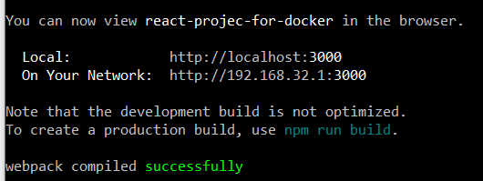

# docker-TP3


## Initialisez un projet React vierge

```
npx create-react-app reac-projec-for-docker

```
## Vérifiez que l'application fonctionne correctement en local

```
cd react-projec-for-docker
 npm start  
```

Résulat :



## Créez un fichier Dockerfile à la racine du projet. Celui-ci doit se diviser en deux grandes parties :
Étape 1 : Construction de l'application React
FROM node:18-alpine as build

Étape 2 : Serveur web pour l'application
FROM nginx:alpine

Voir Dockerfile

## Instanciez l’image

```
docker build -t image-react .
docker run -p 80:80 image-react

```